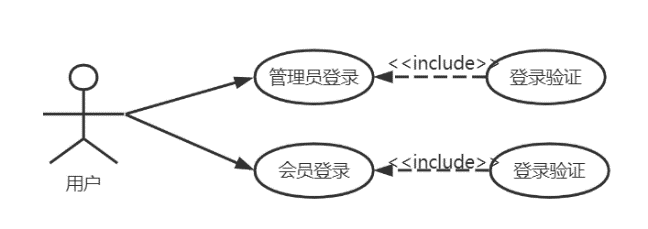
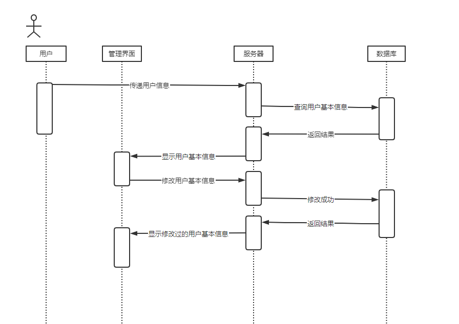
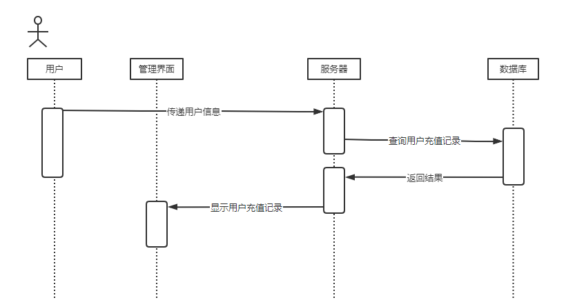

# 健身房管理系统

>
> 鉴于各位朋友们的喜欢，把这个项目的代码修改完善了一下，现在跑起来各功能基本上没有很大的问题
>
> 但是由于当时初学springboot和vue，对很多东西没理解，所以代码写的有点蠢，目前也没有太多时间去修改重构，各位谨慎使用，不要学习代码风格。
>
> 另外，如果对您有帮助，请帮我点个小星星，这将对我帮助很大，感谢！
>
> **注意**：sql文件在doc目录下，mysql8建议使用gym_management.sql导入。如果你是mysql5，可以使用适配5的sql文件 gym_mysql5.sql 导入。
> 
> **会员登录部分是通过手机号登录的，很多朋友这里遇到了问题**
> 
> 需代做毕设，课设，解决问题，远程部署项目等，可联系我QQ:2455675487；微信号：hcfcoding 
> 如需远程帮忙部署这个项目，也可以联系我，66元帮您远程部署好。下面也提供了部署教程，可以参考。


## 小白部署教程

本项目是前后端分离项目，分为前端、后端

##### 前端部署步骤如下

您可在idea或者vs code等任何编辑器中打开vue目录
首先进入到vue这个目录下，打开终端，输入

```shell
npm install
```

如果显示“没有npm命令”等提示，请先检查node是否安装好，环境变量是否配置好

接着会进行包的下载，下载完成后可以对前端进行运行，终端输入

```shell
npm run serve
```

如果提示错误，可以对照一下我的node版本，我的node版本是v16.17.0 npm版本是9.6.6，正常情况下会为您展示前端项目的地址

##### 后端部署步骤如下

首先在数据库管理工具新建gym_management数据库，导入提供的sql文件

IDEA打开springboot目录，打开src/main/resources/application.properties文件

```
spring.datasource.username=root
spring.datasource.password=你的数据库密码
```

然后配置一下maven（maven安装以及修改源等自行找教程），在右边栏中找到maven，然后点击扳手图标选择maven设置，修改maven主路径，用户设置文件、本地仓库成你自己的。

项目的SDK选1.8，项目的文件编码设置成UTF-8。

找到 [DemoApplication.java]直接运行即可


## 1.1 项目意义和目标

随着社会文明的进步，人们希望身心健康、延年益寿，追求精神满足和享受人生乐趣。体育运动是实现这个目标的重要方式之一，它具有健身性、娱乐性、思想性等多方面的作用，而且可以充实人类的文化生活、提高文化水准和生命质量，改善人们的生活习惯，培养高尚品格，对社会的良性发展有积极的调节作用。健身房管理系统可以更好地帮助健身房实现会员信息管理，健身房设备相关管理，提高健身房的运营效率。

## 1.2 开发技术介绍

> 后端框架：SpringBoot
>
> 数据库框架：Mybatis
>
> 数据库：MySQL
>
> 项目构建工具：Maven
>
> 前端框架：Vue，Element UI
>
> 数据图表：ECharts
> 
> 开发工具：IDEA，Webstorm，Navicat
>
> 开发环境：JDK1.8，MySQL8，Vue2


**2. 功能需求**

### 2.1 系统功能描述

此系统实现的主要功能目标为：登录，会员管理，员工管理，器材管理，课程管理，报名表管理。用户登录，课程购买，在线充值，充值记录查看，升级VIP，购买记录查看，个人资料修改，修改密码。

## 2.2 功能需求

### 
## 2.2.1 登录模块

用例图：

图2-2---1-1 登录模块用例图


流程图：


图2-2-1-2 登录模块流程图

### 2.2.2 会员管理模块

用例图：


图2-2-2-1 会员管理模块用例图


流程图：


图2-2-2-2 会员管理模块流程图

### 2.2.3 课程管理模块


用例图：

图2-2-3-1 课程管理模块用例图


流程图：


图2-2-3-2 课程管理模块流程图

### 2.2.4 器材管理模块


图2-2-4-1 器材管理模块用例图


流程图：


图2-2-4-1 器材管理模块流程图

### 2.2.5 员工管理模块


图2-2-5-1 员工管理模块用例图


图2-2-5-2 员工管理模块流程图

### 2.2.6 报名管理模块


图2-2-6-1 报名管理模块用例图


流程图：


图2-2-6-2 报名管理模块流程图

### 2.2.7在线充值模块


图2-2-7-1 在线充值模块用例图


流程图：


图2-2-7-2 在线充值模块流程图

### 2.2.8升级VIP模块

用例图：


图2-2-8-1 升级VIP模块用例图


流程图：


图2-2-8-2 升级VIP模块流程图

### 2.2.9我的资料模块


图2-2-9-1 我的资料模块用例图


图2-2-9-2 我的资料模块流程图

### 2.2.10购买课程模块


图2-2-10-1 购买课程模块用例图


流程图：


图2-2-10-2 购买课程模块流程图

### 2.2.11充值记录模块


图2-2-11-1 充值记录模块用例图


流程图：


图2-2-11-2 充值记录模块流程图

### 2.2.12购买记录模块


图2-2-12-1 购买记录模块用例图


流程图：


图2-2-12-2 购买记录模块流程图

**3 总体设计**

## 3.1 系统功能结构设计 


图3-1 系统功能结构图

## 3.2 系统技术架构设计 


图3-2系统技术架构图


**4. 数据库设计**

## 4.1 数据库 E-R 图


图4-1 健身房管理系统E-R图

## 4.2 数据库物理结构

### 4.2.1 管理员表（admin）

---------------- ------------ -------------- ----------- ------------- --------------
  **字段名**       **含义**     **数据类型**   **长度**    **空/非空**   **约束条件**

  adminNo          管理员编号   Int                        非空          主键/自增

  adminAccount     管理员账号   Varchar        255         非空          

  adminPassword    管理员密码   Varchar        255         非空          
---------------- ------------ -------------- ----------- ------------- --------------

### 4.2.2 会员表（member）

---------------------- ---------- -------------- ----------- ------------- --------------
  **字段名**             **含义**   **数据类型**   **长度**    **空/非空**   **约束条件**

  memberNo               会员编号   int                        非空          主键/自增

  memberUsername         用户名     Varchar        255                       

  memberPassword         会员密码   Varchar        255         非空          

  memberName             姓名       Varchar        255         空            

  memberAge              年龄       int                        空            

  memberGender           性别       varchar        255         空            

  memberPhone            联系方式   varchar        255         非空          

  cardTime               办卡时间   date                       空            

  memberHeight           身高       Double                     空            

  memberWeight           体重       Double                     空            

  memberIntegral         积分       Double                     非空          

  memberChange           余额       Double                     非空          

  memberPower            会员权限   Int                        非空          

  personlizedSignature   个性签名   varchar        255         空            
---------------------- ---------- -------------- ----------- ------------- --------------

### 4.2.3 员工表（employee）

----------------- ---------- -------------- ----------- ------------- --------------
  **字段名**        **含义**   **数据类型**   **长度**    **空/非空**   **约束条件**

  employeeNo        员工工号   int                        非空          唯一/自增

  employeeName      员工姓名   Varchar        255                       

  employeeAge       年龄       int                                      

  employeeGender    性别       varchar        255                       

  employeePhone     联系方式   varchar        255                       

  employeeTime      入职时间   date                                     

  employeeJob       职务       Varchar        255                       

  employeeMessage   备注信息   varchar        255                       
----------------- ---------- -------------- ----------- ------------- --------------

### 4.2.4 课程表（course）

---------------- ---------- -------------- ----------- ------------- --------------
  **字段名**       **含义**   **数据类型**   **长度**    **空/非空**   **约束条件**

  courseNo         课程编号   Int                        非空          自增

  courseName       课程名称   Varchar        255         非空          

  courseTime       开课时间   date                                     

  courseDuration   时长       int                                      

  courseIntegral   课程积分   int                                      

  coursePrice      课程价格   decimal                                  

  employeeNo       教练编号   int                        非空          外键

  managerNo        经理编号   int                        非空          外键

  courseDesc       课程描述   Varchar        255                       
---------------- ---------- -------------- ----------- ------------- --------------

### 4.2.5 器材表（equipment）

------------------- ---------- -------------- ----------- ------------- --------------
  **字段名**          **含义**   **数据类型**   **长度**    **空/非空**   **约束条件**

  equipmentNo         器材编号   Int                        非空          自增

  equipmentName       器材名称   varcahr        255         非空          唯一/自增

  equipmentLocation   位置       Varchar        255                       

  equipmentState      状态       int                                      

  equipmentMessage    备注信息   varchar        255                       
------------------- ---------- -------------- ----------- ------------- --------------

### 4.2.6 报名表（register）

--------------- ------------- -------------- ----------- ------------- --------------
  **字段名**      **含义**      **数据类型**   **长度**    **空/非空**   **约束条件**

  registerNo      报名编号      Int                        非空          自增

  courseNo        课程编号      int                        非空          唯一/自增

  memberNo        会员编号      int                                      外键
--------------- ------------- -------------- ----------- ------------- --------------

### 4.2.7 签到表（checkin）

---------------- ---------- -------------- ----------- ------------- --------------
  **字段名**       **含义**   **数据类型**   **长度**    **空/非空**   **约束条件**

  checkNo          签到编号   Int                        非空          自增

  checkDate        签到日期   datetime                   非空          

  memberNo         会员编号   int                        非空          外键
---------------- ---------- -------------- ----------- ------------- --------------


### 4.2.8 充值表（recharge）

---------------- ---------- -------------- ----------- ------------- --------------
  **字段名**       **含义**   **数据类型**   **长度**    **空/非空**   **约束条件**

  rechargeNo       充值编号   Int                        非空          自增

  rechargeDate     充值日期   datetime                   非空          

  rechargeMethod   充值方式   varchar        255         非空          

  rechargeMoney    充值金额   double                     非空          

  rechargeStatus   充值状态   int                        非空          

  memberNo         会员编号   int                        非空          外键
---------------- ---------- -------------- ----------- ------------- --------------


### 4.2.9 经理表（manager）

---------------- ---------- -------------- ----------- ------------- --------------
  **字段名**       **含义**   **数据类型**   **长度**    **空/非空**   **约束条件**

  managerNo        经理编号   Int                        非空          自增

  employeeNo       员工编号   datetime                   非空          外键
---------------- ---------- -------------- ----------- ------------- --------------

**5. 详细设计**

## 5.1 系统主要功能模块描述

> **登录模块描述：**
>
> 打开第一个界面是登录模块，下方可以选择用户登录或者管理员登录，默认选择会员登录，输入账号密码登录。
>
> **会员管理模块描述：**
>
> 管理员登录后，进入会员管理界面，首先可以看到当前用户信息的表格，包括用户名，姓名，年龄，性别，手机号，身高，体重，注册时间，积分，余额，会员等级，可以对会员信息增删改查，前提时要符合校验规范，在这个模块同时有导入导出表格的功能，方便进行数据统计与传输。
>
> **课程管理模块描述：**
>
> 管理员登录后，进入课程管理界面，首先可以看到当前课程信息的表格，包括课程名称，开课时间，课程时长，教练，教练手机号，经理，经理手机号，课程积分，课程售价，课程描述，可以对课程信息增删改查，前提时要符合校验规范，当删除某课程时需要确保没有用户选课，若有选课则不能删除。提示删除失败
>
> **器材管理模块描述：**
>
> 管理员登录后，进入器材管理界面，首先可以看到当前器材信息的表格，包括器材名称，器材位置，器材状态，备注信息，可以对器材信息增删改查。
>
> **员工管理模块描述：**
>
> 管理员登录后，进入员工管理界面，首先可以看到当前员工信息的表格，包括员工编号，员工姓名，性别，年龄，手机号，入职时间，职务，备注信息，可以对员工信息增删改查，前提时要符合校验规范，当删除某员工时需要确保员工已经无教授课程或管理课程，若有则不能删除。提示删除失败。
>
> **报名管理模块描述：**
>
> 管理员登录后，进入报名管理界面，首先可以看到当前报名表信息的表格，包括课程名称，开课时间，课程时长，教练，教练手机号，可以对报名表信息增删改查。
>
> **全部课程模块描述：**
>
> 用户登录后，点击全部课程，可以看到课程编号，课程名称，课程描述，原价，优惠价，还有部分表格信息由于界面限制，折叠在下档，点击倒三角展开，可以看到教练信息，课程积分，课程时长，教练手机号等，用户可以购买课程，若已经购买过则提示已购买请勿重复购买，若用户余额不足则提示余额不足请充值并且跳转到充值界面。
>
> **在线充值模块描述：**
>
> 用户登录后，点击在线充值，可以看到可用积分，可用余额，充值总额，用户可以点击下方的带有金额的按钮充值，也可以自定义金额充值。
>
> **升级VIP模块描述：**
>
> 用户登录后，点击升级VIP，可以看到可用积分，当前权限，剩余训练次数，一共有四个模块，分别时体验VIP，包月VIP，包季VIP，包年VIP，用户可用根据可用积分来兑换相应的VIP，获得VIP后购买课程有对应的优惠。
>
> **我的资料模块描述：**
>
> 用户登录后，点击我的资料，可以看到用户名，注册时间，姓名，年龄，手机号，身高，体重，性别，个性签名。其中用户名和注册时间不能修改，其余可用修改。
>
> **购买记录模块描述：**
>
> 用户登录后，点击购买记录，可以看到当前购买的课程名称，开课时间，课程时长，教练，教练手机号，会员手机号。
>
> **充值记录模块描述：**
>
> 用户登录后，点击充值记录，可以看到当前的充值记录，表格包括充值时间，金额，方式，状态。

## 5.2 系统功能设计

### 5.2.0 首页

两个图标会随着时间的改变而展示不同年份的数据（需要确保你的会员数据足够多，我的sql里生成的有不同年份的数据）


### 5.2.1 登录模块

登录时序图：


图5-2-1-1用户登录时序图


**用户登录界面（截图）：**


图5-2-1-2用户登录截图

### 5.2.2 会员管理模块

会员管理时序图：


图5-2-2-1用户管理时序图

用户管理界面（截图）：


图5-2-2-2会员管理截图


图5-2-2-3会员管理截图


图5-2-2-4会员管理截图


图5-2-2-5会员管理截图

### 5.2.3 课程管理模块

课程管理时序图：


图5-2-3-1课程管理时序图

课程管理界面（截图）：


图5-2-3-2会员管理截图


图5-2-3-3会员管理截图


图5-2-3-4会员管理截图

### 5.2.4 器材管理模块

课程管理时序图：


图5-2-4-1器材管理时序图

课程管理界面（截图）：


图5-2-4-2器材管理截图


图5-2-4-3器材管理截图


图5-2-4-4器材管理截图

### 5.2.5 员工管理模块

员工管理时序图：


图5-2-5-1员工管理时序图

员工管理界面（截图）：


图5-2-5-2员工管理截图


图5-2-5-3员工管理截图


图5-2-5-4员工管理截图

### 5.2.6 报名管理模块

报名表管理时序图：


图5-2-6-1报名表管理时序图

报名表管理界面（截图）：


图5-2-6-2报名表管理截图


图5-2-6-3报名表管理截图


图5-2-6-4报名表管理截图

### 5.2.7 全部课程模块

全部课程模块时序图：


图5-2-7-1全部课程模块时序图

全部课程模块界面（截图）：


图5-2-7-2全部课程模块截图


图5-2-7-3全部课程模块截图

### 5.2.8在线充值模块

在线充值模块时序图：


图5-2-8-1在线充值模块时序图

在线充值模块界面（截图）：


图5-2-8-2在线充值模块截图


图5-2-8-3在线充值模块截图

### 5.2.9升级VIP模块

升级VIP模块时序图：


图5-2-9-1升级VIP模块时序图

升级VIP模块界面（截图）：


图5-2-9-2升级VIP模块截图


图5-2-9-3升级VIP模块截图

### 5.2.10我的资料模块

我的资料模块时序图：



图5-2-10-1我的资料模块时序图

我的资料界面（截图）：


图5-2-10-2我的资料模块截图


图5-2-10-3我的资料模块截图


图5-2-10-4我的资料模块截图

###  5.2.11充值记录模块

充值记录模块时序图：



图5-2-11-1充值记录模块时序图

充值记录界面（截图）：


图5-2-11-2充值记录模块截图

### 5.2.12购买记录模块

购买记录模块时序图：


图5-2-12-1购买记录模块时序图

购买记录界面（截图）：


图5-2-12-2 购买记录模块截图

**6. 创新设计/代码优化**

## 6.1 创新设计/代码优化描述及意义

在用会员后台设计了一个签到功能，可以通过签到获得积分，使得用户积极登录后台，积分可以兑换VIP以换取优惠。促进会员更多的来到健身房系统，使课程购买量更大。

## 6.2 创新设计/代码优化效果图或效果描述


图6-2-1 签到模块

**7 小结**

本次课程设计是本人目前为止做过的最完整，最复杂的后台管理系统，对我非常具有挑战性，由于疫情推迟，使得有时间学习更新的技术，在暑假期间学习了JS和前端框架VUE.js和element
UI
css的框架，以及前后端传输数据的Axios，并且学会使用Springboot技术做后端开发，做到了真正的前后端开发，彻底摒弃了传统的JSP前后端不分离开发。使得项目维护很简单，在学习期间还学会了版本控制Git，来使得项目出问题能够及时回滚，以及看到版本的更新迭代。

本次课设做的是健身房后台管理系统，分为管理员系统和会员系统，分别是两个不通的界面，对会员管理，课程管理，器材管理，员工管理，报名表管理的增删改查，还实现了会员表导入导出功能，以及批量删除。在主页中整合Echart图表，使得界面的展示更好看。在会员后台，实现了课程购买，在线充值，充值记录，升级VIP，购买记录查看，我的资料修改。使用了VUE的路由守卫，必须登录才能看到后台数据，使得数据更加安全。登录使用JWT技术，来实现每次查看数据时发送token数据到后台验证，进一步保障数据安全。在用户后台实现了一个签到功能，实现时困扰了本人很久，最后想到用浏览器缓存来存储当天的签到日期，后端同时存入数据库，通过查询日期与用户的ID来验证当天是否已经签到。

为了使得界面美观统一，使用后台管理系统流行的框架element
ui来实现界面，减小了前端开发的工作量。最后，本次课设程序还有相当多不足之处，由于时间问题，暂时还没开发一个健身房其前台购买界面，与实际健身房系统还有很大的差距，让我感受到了我的能力离实际开发还有距离，还需努力学习。
