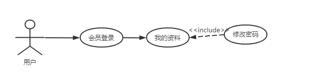

## 1.1 项目意义和目标

随着社会文明的进步，人们希望身心健康、延年益寿，追求精神满足和享受人生乐趣。体育运动是实现这个目标的重要方式之一，它具有健身性、娱乐性、思想性等多方面的作用，而且可以充实人类的文化生活、提高文化水准和生命质量，改善人们的生活习惯，培养高尚品格，对社会的良性发展有积极的调节作用。健身房管理系统可以更好地帮助健身房实现会员信息管理，健身房设备相关管理，提高健身房的运营效率。

## 1.2 开发技术介绍

> 后端框架：SpringBoot
>
> 数据库框架：Mybatis
>
> 数据库：MySQL
>
> 项目构建工具：Maven
>
> 前端框架：Vue，Element UI
>
> 数据图表：ECharts

开发工具：IDEA，Webstorm，Navicat

开发环境：JDK1.8，MySQL8，Vue2

**2. 功能需求**

### 2.1 系统功能描述

此系统实现的主要功能目标为：登录，会员管理，员工管理，器材管理，课程管理，报名表管理。用户登录，课程购买，在线充值，充值记录查看，升级VIP，购买记录查看，个人资料修改，修改密码。

## 2.2 功能需求

### {width="2.9444444444444446in" height="1.0409722222222222in"}2.2.1 登录模块

用例图：

图2-2---1-1 登录模块用例图

用例规约：（M01 表示大模块 M0101表示01大模块中的小模块 以此类推）

+------------+---------------------------------------------------------+
| **         | M01                                                     |
| 功能编号** |                                                         |
+------------+---------------------------------------------------------+
| **         | 登录                                                    |
| 功能名称** |                                                         |
+------------+---------------------------------------------------------+
| **         | 普通用户/管理员                                         |
| 适用角色** |                                                         |
+------------+---------------------------------------------------------+
| **         | 用户输入用户名和密码，点击登录按钮                      |
| 功能描述** |                                                         |
+------------+---------------------------------------------------------+
| **从       | 程序启动，进入登录界面                                  |
| 何处开始** |                                                         |
+------------+---------------------------------------------------------+
| **         | 登录成功跳转到管理界面，登录失败弹出登录失败对话框      |
| 以何结束** |                                                         |
+------------+---------------------------------------------------------+
| **输入**   | 用户名，密码                                            |
+------------+---------------------------------------------------------+
| **         | 1.  用户启动系统，启动用例                              |
| 过程描述** |                                                         |
|            | 2.  系统显示登录信息填写界面                            |
|            |                                                         |
|            | 3.  用户输入账号密码，并选择登录角色；                  |
|            |                                                         |
|            | 4.  系统检验账号密码格式是否正确；                      |
|            |                                                         |
|            | 5.  格式正确，用户点击登录按钮；                        |
|            |                                                         |
|            | 6.  系统检验账号密码是否存在；                          |
|            |                                                         |
|            | 7.  登录成功，提示登录成功，跳转到管理界面，用例结束    |
+------------+---------------------------------------------------------+
| **输出**   | 登录成功/登录失败                                       |
+------------+---------------------------------------------------------+
| **         | 用户名和密码必须输入                                    |
| 约束条件** |                                                         |
+------------+---------------------------------------------------------+
| **相关     | 无                                                      |
| 业务规则** |                                                         |
+------------+---------------------------------------------------------+
| **         | 1.  未输入用户名                                        |
| 异常描述** |                                                         |
|            | 2.  用户名不存在                                        |
|            |                                                         |
|            | 3.  未输入密码                                          |
|            |                                                         |
|            | 4.  密码不正确                                          |
+------------+---------------------------------------------------------+

流程图：

{width="5.592361111111111in" height="4.75in"}

图2-2-1-2 登录模块流程图

### 2.2.2 会员管理模块

用例图：

{width="3.6131944444444444in"
height="1.9381944444444446in"}

图2-2-2-1 会员管理模块用例图

用例规约：

+------------+---------------------------------------------------------+
| **         | M0101                                                   |
| 功能编号** |                                                         |
+------------+---------------------------------------------------------+
| **         | 会员管理                                                |
| 功能名称** |                                                         |
+------------+---------------------------------------------------------+
| **         | 管理员                                                  |
| 适用角色** |                                                         |
+------------+---------------------------------------------------------+
| **         | 登录之后，                                              |
| 功能描述** | 点击会员管理，可以对会员增删改查，并且导入导出会员数据  |
+------------+---------------------------------------------------------+
| **从       | 点击会员管理                                            |
| 何处开始** |                                                         |
+------------+---------------------------------------------------------+
| **         | 通过侧边栏点击到别的模块                                |
| 以何结束** |                                                         |
+------------+---------------------------------------------------------+
| **输入**   | 增删改查                                                |
+------------+---------------------------------------------------------+
| **         | 1.  登录完成后，点击会员管理                            |
| 过程描述** |                                                         |
|            | 2.  进入会员管理模块，点击新增会员，输入新会员信息      |
|            |                                                         |
|            | 3.  点击确定，新增成功。                                |
|            |                                                         |
|            | 4.  点击表格处删除会员，确定，删除成功。                |
|            |                                                         |
|            | 5.  点击表格处                                          |
|            | 编辑，修改会员，输入需要更改的部分，点击确定修改成功。  |
|            |                                                         |
|            | 6.                                                      |
|            | 点击表格处导入表格，将准备好的excle文件导入，导入成功。 |
|            |                                                         |
|            | 7.  点击表格处导出，将现有会员表导出。                  |
+------------+---------------------------------------------------------+
| **输出**   | 增删改查成功/增删改查失败                               |
+------------+---------------------------------------------------------+
| **         | 新增会员需要按照校验规则输入，编辑会员信息时同理。      |
| 约束条件** |                                                         |
+------------+---------------------------------------------------------+
| **相关     | 无                                                      |
| 业务规则** |                                                         |
+------------+---------------------------------------------------------+
| **         | 1.  添加时用户手机号已存在                              |
| 异常描述** |                                                         |
|            | 2.  编辑时用户手机号已存在                              |
|            |                                                         |
|            | 3.  删除会员时，会员已经购课并且充值                    |
+------------+---------------------------------------------------------+

流程图：

{width="5.592361111111111in" height="5.73125in"}

图2-2-2-2 会员管理模块流程图

### 2.2.3 课程管理模块

{width="4.893055555555556in"
height="1.961111111111111in"}用例图：

图2-2-3-1 课程管理模块用例图

用例规约：

+------------+---------------------------------------------------------+
| **         | M0102                                                   |
| 功能编号** |                                                         |
+------------+---------------------------------------------------------+
| **         | 课程管理                                                |
| 功能名称** |                                                         |
+------------+---------------------------------------------------------+
| **         | 管理员                                                  |
| 适用角色** |                                                         |
+------------+---------------------------------------------------------+
| **         | 登录之后，点击课程管理，可以对课程增删改查              |
| 功能描述** |                                                         |
+------------+---------------------------------------------------------+
| **从       | 点击课程管理                                            |
| 何处开始** |                                                         |
+------------+---------------------------------------------------------+
| **         | 通过侧边栏点击到别的模块                                |
| 以何结束** |                                                         |
+------------+---------------------------------------------------------+
| **输入**   | 增删改查                                                |
+------------+---------------------------------------------------------+
| **         | 1.  登录完成后，点击课程管理                            |
| 过程描述** |                                                         |
|            | 2.  进入课程管理模块，点击新增课程，输入新课程信息      |
|            |                                                         |
|            | 3.  点击确定，新增成功。                                |
|            |                                                         |
|            | 4.  点击表格处删除课程，确定，删除成功。                |
|            |                                                         |
|            | 5.  点击表格处                                          |
|            | 编辑，修改会员，输入需要更改的部分，点击确定修改成功。  |
+------------+---------------------------------------------------------+
| **输出**   | 增删改查成功/增删改查失败                               |
+------------+---------------------------------------------------------+
| **         | 新增课程需要按照校验规则输入，编辑课程信息时同理。      |
| 约束条件** |                                                         |
+------------+---------------------------------------------------------+
| **相关     | 无                                                      |
| 业务规则** |                                                         |
+------------+---------------------------------------------------------+
| **         | 1.  添加课程时所选教练或者项目经理排期已满              |
| 异常描述** |                                                         |
|            | 2.  编辑时与其他课程时间冲突                            |
|            |                                                         |
|            | 3.  删除时，会员已经购该课                              |
+------------+---------------------------------------------------------+

流程图：

{width="5.324305555555555in"
height="5.842361111111111in"}

图2-2-3-2 课程管理模块流程图

### 2.2.4 器材管理模块

{width="3.9409722222222223in"
height="1.867361111111111in"}用例图：

图2-2-4-1 器材管理模块用例图

用例规约：

+------------+---------------------------------------------------------+
| **         | M0103                                                   |
| 功能编号** |                                                         |
+------------+---------------------------------------------------------+
| **         | 器材管理                                                |
| 功能名称** |                                                         |
+------------+---------------------------------------------------------+
| **         | 管理员                                                  |
| 适用角色** |                                                         |
+------------+---------------------------------------------------------+
| **         | 登录之后，点击器材管理，可以对器材增删改查              |
| 功能描述** |                                                         |
+------------+---------------------------------------------------------+
| **从       | 点击器材管理                                            |
| 何处开始** |                                                         |
+------------+---------------------------------------------------------+
| **         | 通过侧边栏点击到别的模块                                |
| 以何结束** |                                                         |
+------------+---------------------------------------------------------+
| **输入**   | 增删改查                                                |
+------------+---------------------------------------------------------+
| **         | 1.  登录完成后，点击器材管理                            |
| 过程描述** |                                                         |
|            | 2.  进入器材管理模块，点击新增器材，输入新器材信息      |
|            |                                                         |
|            | 3.  点击确定，新增成功。                                |
|            |                                                         |
|            | 4.  点击表格处删除器材，确定，删除成功。                |
|            |                                                         |
|            | 5.  点击表格处                                          |
|            | 编辑，修改会员，输入需要更改的部分，点击确定修改成功。  |
+------------+---------------------------------------------------------+
| **输出**   | 增删改查成功/增删改查失败                               |
+------------+---------------------------------------------------------+
| **         | 新增器材需要按照校验规则输入，编辑器材信息时同理。      |
| 约束条件** |                                                         |
+------------+---------------------------------------------------------+
| **相关     | 无                                                      |
| 业务规则** |                                                         |
+------------+---------------------------------------------------------+
| **         | 1.  添加器材时所不符合校验规范                          |
| 异常描述** |                                                         |
+------------+---------------------------------------------------------+

流程图：

{width="5.592361111111111in" height="5.98125in"}

图2-2-4-1 器材管理模块流程图

### 2.2.5 员工管理模块

{width="4.585416666666666in"
height="1.9916666666666667in"}用例图：

图2-2-5-1 员工管理模块用例图

用例规约：

+------------+---------------------------------------------------------+
| **         | M0104                                                   |
| 功能编号** |                                                         |
+------------+---------------------------------------------------------+
| **         | 员工管理                                                |
| 功能名称** |                                                         |
+------------+---------------------------------------------------------+
| **         | 管理员                                                  |
| 适用角色** |                                                         |
+------------+---------------------------------------------------------+
| **         | 登录之后，点击员工管理，可以对员工删改查                |
| 功能描述** |                                                         |
+------------+---------------------------------------------------------+
| **从       | 点击员工管理                                            |
| 何处开始** |                                                         |
+------------+---------------------------------------------------------+
| **         | 通过侧边栏点击到别的模块                                |
| 以何结束** |                                                         |
+------------+---------------------------------------------------------+
| **输入**   | 增删改查                                                |
+------------+---------------------------------------------------------+
| **         | 1.  登录完成后，点击员工管理                            |
| 过程描述** |                                                         |
|            | 2.  进入员工管理模块，点击新增员工，输入新员工信息      |
|            |                                                         |
|            | 3.  点击确定，新增成功。                                |
|            |                                                         |
|            | 4.  点击表格处删除员工，确定，删除成功，设置离职时间。  |
|            |                                                         |
|            | 5.  点击表格处编辑                                      |
|            | ，修改员工信息，输入需要更改的部分，点击确定修改成功。  |
+------------+---------------------------------------------------------+
| **输出**   | 增删改查成功/增删改查失败                               |
+------------+---------------------------------------------------------+
| **         | 新增员工需要按照校验规则输入，编辑员工信息时同理。      |
| 约束条件** |                                                         |
+------------+---------------------------------------------------------+
| **相关     | 无                                                      |
| 业务规则** |                                                         |
+------------+---------------------------------------------------------+
| **         | 1.  编辑教练手机号时已有会员选择所教授的课程            |
| 异常描述** |                                                         |
|            | 2.  删除教练时，已有会员选择所教授的课程。              |
+------------+---------------------------------------------------------+

流程图：

{width="5.602083333333334in"
height="5.990972222222222in"}

图2-2-5-2 员工管理模块流程图

### 2.2.6 报名管理模块

{width="3.911111111111111in"
height="1.6208333333333333in"}用例图：

图2-2-6-1 报名管理模块用例图

用例规约：

+------------+---------------------------------------------------------+
| **         | M0105                                                   |
| 功能编号** |                                                         |
+------------+---------------------------------------------------------+
| **         | 报名管理                                                |
| 功能名称** |                                                         |
+------------+---------------------------------------------------------+
| **         | 管理员                                                  |
| 适用角色** |                                                         |
+------------+---------------------------------------------------------+
| **         | 登录之后，点击报名管理，可以对报名表删改查              |
| 功能描述** |                                                         |
+------------+---------------------------------------------------------+
| **从       | 点击报名管理                                            |
| 何处开始** |                                                         |
+------------+---------------------------------------------------------+
| **         | 通过侧边栏点击到别的模块                                |
| 以何结束** |                                                         |
+------------+---------------------------------------------------------+
| **输入**   | 增删改查                                                |
+------------+---------------------------------------------------------+
| **         | 1.  登录完成后，点击报名管理                            |
| 过程描述** |                                                         |
|            | 2.  进入报名管理模块，点击新增报名，输入新报名信息      |
|            |                                                         |
|            | 3.  点击确定，新增成功。                                |
|            |                                                         |
|            | 4.  点击表格处删除报名，确定，删除成功。                |
|            |                                                         |
|            | 5.  点击表格处编辑                                      |
|            | ，修改报名信息，输入需要更改的部分，点击确定修改成功。  |
+------------+---------------------------------------------------------+
| **输出**   | 增删改查成功/增删改查失败                               |
+------------+---------------------------------------------------------+
| **         | 新增报名时通过输入会员手机号绑定                        |
| 约束条件** |                                                         |
+------------+---------------------------------------------------------+
| **相关     | 无                                                      |
| 业务规则** |                                                         |
+------------+---------------------------------------------------------+
| **         | 1.  手机号不存在                                        |
| 异常描述** |                                                         |
|            | 2.  该会员在该时段已经选课                              |
|            |                                                         |
|            | 3.  会员已经购买该课程                                  |
+------------+---------------------------------------------------------+

流程图：

{width="5.592361111111111in"
height="5.7131944444444445in"}

图2-2-6-2 报名管理模块流程图

### 2.2.7在线充值模块

{width="4.683333333333334in"
height="2.0in"}用例图：

图2-2-7-1 在线充值模块用例图

用例规约：

+------------+---------------------------------------------------------+
| **         | M0106                                                   |
| 功能编号** |                                                         |
+------------+---------------------------------------------------------+
| **         | 在线充值                                                |
| 功能名称** |                                                         |
+------------+---------------------------------------------------------+
| **         | 会员                                                    |
| 适用角色** |                                                         |
+------------+---------------------------------------------------------+
| **         | 登录之后，点                                            |
| 功能描述** | 击在线充值，可以查看会员余额，积分，总充值额，充值余额  |
+------------+---------------------------------------------------------+
| **从       | 点击在线充值                                            |
| 何处开始** |                                                         |
+------------+---------------------------------------------------------+
| **         | 通过侧边栏点击到别的模块                                |
| 以何结束** |                                                         |
+------------+---------------------------------------------------------+
| **输入**   | 根据登录信息获取用户ID传入后台                          |
+------------+---------------------------------------------------------+
| **         | 1.  登录完                                              |
| 过程描述** | 成后，点击在线充值，自动展示出会员余额，积分，总充值额  |
|            |                                                         |
|            | 2.  进入在线充值模块，可以选择                          |
|            | 设置好的金额，也可以输入充值金额，点击确定，充值成功。  |
+------------+---------------------------------------------------------+
| **输出**   | 充值成功/充值失败                                       |
+------------+---------------------------------------------------------+
| **         | 充值金额输入为整数                                      |
| 约束条件** |                                                         |
+------------+---------------------------------------------------------+
| **相关     | 无                                                      |
| 业务规则** |                                                         |
+------------+---------------------------------------------------------+
| **         | 1.  充值金额不是正整数                                  |
| 异常描述** |                                                         |
+------------+---------------------------------------------------------+

流程图：

{width="5.370138888888889in"
height="2.870138888888889in"}

图2-2-7-2 在线充值模块流程图

### 2.2.8升级VIP模块

用例图：

{width="4.528472222222222in"
height="2.3513888888888888in"}

图2-2-8-1 升级VIP模块用例图

用例规约：

+------------+---------------------------------------------------------+
| **         | M0107                                                   |
| 功能编号** |                                                         |
+------------+---------------------------------------------------------+
| **         | 升级VIP                                                 |
| 功能名称** |                                                         |
+------------+---------------------------------------------------------+
| **         | 会员                                                    |
| 适用角色** |                                                         |
+------------+---------------------------------------------------------+
| **         | 登录之后，点击升级                                      |
| 功能描述** | VIP，可以查看会员当前权限，积分，训练次数，积分兑换VIP  |
+------------+---------------------------------------------------------+
| **从       | 点击升级VIP                                             |
| 何处开始** |                                                         |
+------------+---------------------------------------------------------+
| **         | 通过侧边栏点击到别的模块                                |
| 以何结束** |                                                         |
+------------+---------------------------------------------------------+
| **输入**   | 根据登录信息获取用户ID传入后台                          |
+------------+---------------------------------------------------------+
| **         | 1.  登录完                                              |
| 过程描述** | 成后，点击升级VIP，自动展示会员当前权限，积分，训练次数 |
|            |                                                         |
|            | 2.  点击需要升级的VIP种类，点击确定，兑换成功。         |
+------------+---------------------------------------------------------+
| **输出**   | 兑换成功/兑换失败                                       |
+------------+---------------------------------------------------------+
| **         | 积分余额大于升级VIP所需积分                             |
| 约束条件** |                                                         |
+------------+---------------------------------------------------------+
| **相关     | 无                                                      |
| 业务规则** |                                                         |
+------------+---------------------------------------------------------+
| **         | 1.  积分不足                                            |
| 异常描述** |                                                         |
+------------+---------------------------------------------------------+

流程图：

{width="5.592361111111111in"
height="3.138888888888889in"}

图2-2-8-2 升级VIP模块流程图

### 2.2.9我的资料模块

{width="4.701388888888889in"
height="1.125in"}用例图：

图2-2-9-1 我的资料模块用例图

用例规约：

+------------+---------------------------------------------------------+
| **         | M0107                                                   |
| 功能编号** |                                                         |
+------------+---------------------------------------------------------+
| **         | 我的资料                                                |
| 功能名称** |                                                         |
+------------+---------------------------------------------------------+
| **         | 会员                                                    |
| 适用角色** |                                                         |
+------------+---------------------------------------------------------+
| **         | 登录之后                                                |
| 功能描述** | ，点击我的资料，可以查看会员个人信息，并且修改个人信息  |
+------------+---------------------------------------------------------+
| **从       | 点击我的资料                                            |
| 何处开始** |                                                         |
+------------+---------------------------------------------------------+
| **         | 通过侧边栏点击到别的模块                                |
| 以何结束** |                                                         |
+------------+---------------------------------------------------------+
| **输入**   | 根据登录信息获取用户ID传入后台                          |
+------------+---------------------------------------------------------+
| **         | 1.  登录完成后，点击我的资料，自动展示会员个人信息      |
| 过程描述** |                                                         |
|            | 2.  点击需要更新的个人资料，点击确定，修改成功。        |
|            |                                                         |
|            | 3.  点击修改密                                          |
|            | 码，输入旧密码，新密码，确认密码，点击修改，修改成功。  |
+------------+---------------------------------------------------------+
| **输出**   | 修改成功/修改失败                                       |
+------------+---------------------------------------------------------+
| **         | 修改提交表单需满足约束规则                              |
| 约束条件** |                                                         |
+------------+---------------------------------------------------------+
| **相关     | 无                                                      |
| 业务规则** |                                                         |
+------------+---------------------------------------------------------+
| **         | 1.  旧密码错误                                          |
| 异常描述** |                                                         |
|            | 2.  两次输入的密码不一致                                |
+------------+---------------------------------------------------------+

{width="6.898611111111111in"
height="1.1423611111111112in"}流程图：

图2-2-9-2 我的资料模块流程图

### 2.2.10购买课程模块

{width="3.7194444444444446in"
height="1.2201388888888889in"}用例图：

图2-2-10-1 购买课程模块用例图

用例规约：

+------------+---------------------------------------------------------+
| **         | M0108                                                   |
| 功能编号** |                                                         |
+------------+---------------------------------------------------------+
| **         | 购买课程                                                |
| 功能名称** |                                                         |
+------------+---------------------------------------------------------+
| **         | 会员                                                    |
| 适用角色** |                                                         |
+------------+---------------------------------------------------------+
| **         | 登录之后                                                |
| 功能描述** | ，点击购买课程，可以查看所有课程信息，并且点击购买课程  |
+------------+---------------------------------------------------------+
| **从       | 点击购买课程                                            |
| 何处开始** |                                                         |
+------------+---------------------------------------------------------+
| **         | 通过侧边栏点击到别的模块                                |
| 以何结束** |                                                         |
+------------+---------------------------------------------------------+
| **输入**   | 根据登录信息获取用户ID传入后台                          |
+------------+---------------------------------------------------------+
| **         | 1.  登录完成后，点击购买课程，自动展示所有课程信息      |
| 过程描述** |                                                         |
|            | 2.                                                      |
|            |  点击需要购买的课程，购买成功，扣款，加积分，用例结束。 |
+------------+---------------------------------------------------------+
| **输出**   | 购买成功/购买失败                                       |
+------------+---------------------------------------------------------+
| **         | 不能购买已经购买的课程，余额需大于所购买的课程          |
| 约束条件** |                                                         |
+------------+---------------------------------------------------------+
| **相关     | 无                                                      |
| 业务规则** |                                                         |
+------------+---------------------------------------------------------+
| **         | 1.  该课程已经购买                                      |
| 异常描述** |                                                         |
|            | 2.  余额不足                                            |
|            |                                                         |
|            | 3.  所购买课程与此前购买课程时间冲突                    |
+------------+---------------------------------------------------------+

流程图：

{width="6.0465277777777775in"
height="1.3888888888888888in"}

图2-2-10-2 购买课程模块流程图

### 2.2.11充值记录模块

{width="3.3409722222222222in"
height="1.2145833333333333in"}用例图：

图2-2-11-1 充值记录模块用例图

用例规约：

+------------+---------------------------------------------------------+
| **         | M0109                                                   |
| 功能编号** |                                                         |
+------------+---------------------------------------------------------+
| **         | 充值记录                                                |
| 功能名称** |                                                         |
+------------+---------------------------------------------------------+
| **         | 会员                                                    |
| 适用角色** |                                                         |
+------------+---------------------------------------------------------+
| **         | 登录之后，点击充值记录，可以查看所有充值记录            |
| 功能描述** |                                                         |
+------------+---------------------------------------------------------+
| **从       | 点击充值记录                                            |
| 何处开始** |                                                         |
+------------+---------------------------------------------------------+
| **         | 通过侧边栏点击到别的模块                                |
| 以何结束** |                                                         |
+------------+---------------------------------------------------------+
| **输入**   | 根据登录信息获取用户ID传入后台                          |
+------------+---------------------------------------------------------+
| **         | 1.  登录完成后，点击充值记录，自动展示所有充值记录      |
| 过程描述** |                                                         |
+------------+---------------------------------------------------------+
| **输出**   | 查询到充值记录/无记录                                   |
+------------+---------------------------------------------------------+
| **         | 无                                                      |
| 约束条件** |                                                         |
+------------+---------------------------------------------------------+
| **相关     | 无                                                      |
| 业务规则** |                                                         |
+------------+---------------------------------------------------------+
| **         | 无                                                      |
| 异常描述** |                                                         |
+------------+---------------------------------------------------------+

流程图：

{width="5.592361111111111in"
height="1.4444444444444444in"}

图2-2-11-2 充值记录模块流程图

### 2.2.12购买记录模块

{width="3.511111111111111in"
height="1.0520833333333333in"}用例图：

图2-2-12-1 购买记录模块用例图

用例规约：

------------------ ---------------------------------------------------------
  **功能编号**       M01010

  **功能名称**       购买记录

  **适用角色**       会员

  **功能描述**       登录之后，点击购买记录，可以查看所有购买记录

  **从何处开始**     点击购买记录

  **以何结束**       通过侧边栏点击到别的模块

  **输入**           根据登录信息获取用户ID传入后台

  **过程描述**       1.登录完成后，点击购买记录，自动展示所有购买记录

  **输出**           查询到充值记录/无记录

  **约束条件**       无

  **相关业务规则**   无

  **异常描述**       无
------------------ ---------------------------------------------------------

流程图：

{width="5.592361111111111in"
height="1.4166666666666667in"}

图2-2-12-2 购买记录模块流程图

**3 总体设计**

## 3.1 系统功能结构设计 

{width="6.885416666666667in"
height="2.8583333333333334in"}

图3-1 系统功能结构图

## 3.2 系统技术架构设计 

{width="3.772222222222222in"
height="3.013888888888889in"}

图3-2系统技术架构图

**4. 数据库设计**

## 4.1 数据库 E-R 图

{width="6.305555555555555in"
height="4.5368055555555555in"}

图4-1 健身房管理系统E-R图

## 4.2 数据库物理结构

### 4.2.1 管理员表（admin）

---------------- ------------ -------------- ----------- ------------- --------------
  **字段名**       **含义**     **数据类型**   **长度**    **空/非空**   **约束条件**

  adminNo          管理员编号   Int                        非空          主键/自增

  adminAccount     管理员账号   Varchar        255         非空          

  adminPassword    管理员密码   Varchar        255         非空          
---------------- ------------ -------------- ----------- ------------- --------------

### 4.2.2 会员表（member）

---------------------- ---------- -------------- ----------- ------------- --------------
  **字段名**             **含义**   **数据类型**   **长度**    **空/非空**   **约束条件**

  memberNo               会员编号   int                        非空          主键/自增

  memberUsername         用户名     Varchar        255                       

  memberPassword         会员密码   Varchar        255         非空          

  memberName             姓名       Varchar        255         空            

  memberAge              年龄       int                        空            

  memberGender           性别       varchar        255         空            

  memberPhone            联系方式   varchar        255         非空          

  cardTime               办卡时间   date                       空            

  memberHeight           身高       Double                     空            

  memberWeight           体重       Double                     空            

  memberIntegral         积分       Double                     非空          

  memberChange           余额       Double                     非空          

  memberPower            会员权限   Int                        非空          

  personlizedSignature   个性签名   varchar        255         空            
---------------------- ---------- -------------- ----------- ------------- --------------

### 4.2.3 员工表（employee）

----------------- ---------- -------------- ----------- ------------- --------------
  **字段名**        **含义**   **数据类型**   **长度**    **空/非空**   **约束条件**

  employeeNo        员工工号   int                        非空          唯一/自增

  employeeName      员工姓名   Varchar        255                       

  employeeAge       年龄       int                                      

  employeeGender    性别       varchar        255                       

  employeePhone     联系方式   varchar        255                       

  employeeTime      入职时间   date                                     

  employeeJob       职务       Varchar        255                       

  employeeMessage   备注信息   varchar        255                       
----------------- ---------- -------------- ----------- ------------- --------------

### 4.2.4 课程表（course）

---------------- ---------- -------------- ----------- ------------- --------------
  **字段名**       **含义**   **数据类型**   **长度**    **空/非空**   **约束条件**

  courseNo         课程编号   Int                        非空          自增

  courseName       课程名称   Varchar        255         非空          

  courseTime       开课时间   date                                     

  courseDuration   时长       int                                      

  courseIntegral   课程积分   int                                      

  coursePrice      课程价格   decimal                                  

  employeeNo       教练编号   int                        非空          外键

  managerNo        经理编号   int                        非空          外键

  courseDesc       课程描述   Varchar        255                       
---------------- ---------- -------------- ----------- ------------- --------------

### 4.2.5 器材表（equipment）

------------------- ---------- -------------- ----------- ------------- --------------
  **字段名**          **含义**   **数据类型**   **长度**    **空/非空**   **约束条件**

  equipmentNo         器材编号   Int                        非空          自增

  equipmentName       器材名称   varcahr        255         非空          唯一/自增

  equipmentLocation   位置       Varchar        255                       

  equipmentState      状态       int                                      

  equipmentMessage    备注信息   varchar        255                       
------------------- ---------- -------------- ----------- ------------- --------------

### 4.2.6 报名表（register）

--------------- ------------- -------------- ----------- ------------- --------------
  **字段名**      **含义**      **数据类型**   **长度**    **空/非空**   **约束条件**

  registerNo      报名编号      Int                        非空          自增

  courseNo        课程编号      int                        非空          唯一/自增

  memberNo        会员编号      int                                      外键
--------------- ------------- -------------- ----------- ------------- --------------

### 4.2.7 签到表（checkin）

---------------- ---------- -------------- ----------- ------------- --------------
  **字段名**       **含义**   **数据类型**   **长度**    **空/非空**   **约束条件**

  checkNo          签到编号   Int                        非空          自增

  checkDate        签到日期   datetime                   非空          

  memberNo         会员编号   int                        非空          外键
---------------- ---------- -------------- ----------- ------------- --------------

### 4.2.8 充值表（recharge）

---------------- ---------- -------------- ----------- ------------- --------------
  **字段名**       **含义**   **数据类型**   **长度**    **空/非空**   **约束条件**

  rechargeNo       充值编号   Int                        非空          自增

  rechargeDate     充值日期   datetime                   非空          

  rechargeMethod   充值方式   varchar        255         非空          

  rechargeMoney    充值金额   double                     非空          

  rechargeStatus   充值状态   int                        非空          

  memberNo         会员编号   int                        非空          外键
---------------- ---------- -------------- ----------- ------------- --------------

### 4.2.9 经理表（manager）

---------------- ---------- -------------- ----------- ------------- --------------
  **字段名**       **含义**   **数据类型**   **长度**    **空/非空**   **约束条件**

  managerNo        经理编号   Int                        非空          自增

  employeeNo       员工编号   datetime                   非空          外键
---------------- ---------- -------------- ----------- ------------- --------------

**5. 详细设计**

## 5.1 系统主要功能模块描述

> **登录模块描述：**
>
> 打开第一个界面是登录模块，下方可以选择用户登录或者管理员登录，默认选择会员登录，输入账号密码登录。
>
> **会员管理模块描述：**
>
> 管理员登录后，进入会员管理界面，首先可以看到当前用户信息的表格，包括用户名，姓名，年龄，性别，手机号，身高，体重，注册时间，积分，余额，会员等级，可以对会员信息增删改查，前提时要符合校验规范，在这个模块同时有导入导出表格的功能，方便进行数据统计与传输。
>
> **课程管理模块描述：**
>
> 管理员登录后，进入课程管理界面，首先可以看到当前课程信息的表格，包括课程名称，开课时间，课程时长，教练，教练手机号，经理，经理手机号，课程积分，课程售价，课程描述，可以对课程信息增删改查，前提时要符合校验规范，当删除某课程时需要确保没有用户选课，若有选课则不能删除。提示删除失败
>
> **器材管理模块描述：**
>
> 管理员登录后，进入器材管理界面，首先可以看到当前器材信息的表格，包括器材名称，器材位置，器材状态，备注信息，可以对器材信息增删改查。
>
> **员工管理模块描述：**
>
> 管理员登录后，进入员工管理界面，首先可以看到当前员工信息的表格，包括员工编号，员工姓名，性别，年龄，手机号，入职时间，职务，备注信息，可以对员工信息增删改查，前提时要符合校验规范，当删除某员工时需要确保员工已经无教授课程或管理课程，若有则不能删除。提示删除失败。
>
> **报名管理模块描述：**
>
> 管理员登录后，进入报名管理界面，首先可以看到当前报名表信息的表格，包括课程名称，开课时间，课程时长，教练，教练手机号，可以对报名表信息增删改查。
>
> **全部课程模块描述：**
>
> 用户登录后，点击全部课程，可以看到课程编号，课程名称，课程描述，原价，优惠价，还有部分表格信息由于界面限制，折叠在下档，点击倒三角展开，可以看到教练信息，课程积分，课程时长，教练手机号等，用户可以购买课程，若已经购买过则提示已购买请勿重复购买，若用户余额不足则提示余额不足请充值并且跳转到充值界面。
>
> **在线充值模块描述：**
>
> 用户登录后，点击在线充值，可以看到可用积分，可用余额，充值总额，用户可以点击下方的带有金额的按钮充值，也可以自定义金额充值。
>
> **升级VIP模块描述：**
>
> 用户登录后，点击升级VIP，可以看到可用积分，当前权限，剩余训练次数，一共有四个模块，分别时体验VIP，包月VIP，包季VIP，包年VIP，用户可用根据可用积分来兑换相应的VIP，获得VIP后购买课程有对应的优惠。
>
> **我的资料模块描述：**
>
> 用户登录后，点击我的资料，可以看到用户名，注册时间，姓名，年龄，手机号，身高，体重，性别，个性签名。其中用户名和注册时间不能修改，其余可用修改。
>
> **购买记录模块描述：**
>
> 用户登录后，点击购买记录，可以看到当前购买的课程名称，开课时间，课程时长，教练，教练手机号，会员手机号。
>
> **充值记录模块描述：**
>
> 用户登录后，点击充值记录，可以看到当前的充值记录，表格包括充值时间，金额，方式，状态。

## 5.2 系统功能设计

### 5.2.1 登录模块

登录时序图：

{width="6.305555555555555in"
height="3.990972222222222in"}

图5-2-1-1用户登录时序图

**用户登录界面（截图）：**

{width="4.990972222222222in" height="3.23125in"}

图5-2-1-2用户登录截图

### 5.2.2 会员管理模块

会员管理时序图：

{width="5.51875in" height="6.194444444444445in"}

图5-2-2-1用户管理时序图

用户管理界面（截图）：

{width="5.592361111111111in"
height="2.814583333333333in"}

图5-2-2-2会员管理截图

{width="5.592361111111111in"
height="2.8055555555555554in"}

图5-2-2-3会员管理截图

{width="5.592361111111111in"
height="1.9631944444444445in"}

图5-2-2-4会员管理截图

{width="5.592361111111111in" height="2.73125in"}

图5-2-2-5会员管理截图

### 5.2.3 课程管理模块

课程管理时序图：

{width="5.592361111111111in"
height="5.897916666666666in"}

图5-2-3-1课程管理时序图

课程管理界面（截图）：

{width="5.361111111111111in" height="2.0in"}

图5-2-3-2会员管理截图

{width="5.416666666666667in"
height="2.361111111111111in"}

图5-2-3-3会员管理截图

{width="5.352083333333334in"
height="2.564583333333333in"}

图5-2-3-4会员管理截图

### 5.2.4 器材管理模块

课程管理时序图：

{width="5.592361111111111in"
height="5.472222222222222in"}

图5-2-4-1器材管理时序图

课程管理界面（截图）：

{width="5.259027777777778in" height="1.98125in"}

图5-2-4-2器材管理截图

{width="5.26875in"
height="2.1479166666666667in"}

图5-2-4-3器材管理截图

{width="5.472222222222222in"
height="1.8979166666666667in"}

图5-2-4-4器材管理截图

### 5.2.5 员工管理模块

员工管理时序图：

{width="4.897916666666666in"
height="5.185416666666667in"}

图5-2-5-1员工管理时序图

员工管理界面（截图）：

{width="5.592361111111111in"
height="2.1020833333333333in"}

图5-2-5-2员工管理截图

{width="5.592361111111111in"
height="1.9631944444444445in"}

图5-2-5-3员工管理截图

{width="5.592361111111111in"
height="1.9354166666666666in"}

图5-2-5-4员工管理截图

### 5.2.6 报名管理模块

报名表管理时序图：

{width="5.592361111111111in"
height="4.935416666666667in"}

图5-2-6-1报名表管理时序图

报名表管理界面（截图）：

{width="5.583333333333333in"
height="2.1479166666666667in"}

图5-2-6-2报名表管理截图

{width="5.592361111111111in"
height="1.9256944444444444in"}

图5-2-6-3报名表管理截图

{width="5.592361111111111in"
height="1.9076388888888889in"}

图5-2-6-4报名表管理截图

### 5.2.7 全部课程模块

全部课程模块时序图：

{width="5.592361111111111in"
height="4.897916666666666in"}

图5-2-7-1全部课程模块时序图

全部课程模块界面（截图）：

{width="5.583333333333333in"
height="2.1756944444444444in"}

图5-2-7-2全部课程模块截图

{width="5.592361111111111in"
height="2.314583333333333in"}

图5-2-7-3全部课程模块截图

### 5.2.8在线充值模块

在线充值模块时序图：

{width="5.592361111111111in"
height="4.370138888888889in"}

图5-2-8-1在线充值模块时序图

在线充值模块界面（截图）：

{width="5.592361111111111in"
height="2.759027777777778in"}

图5-2-8-2在线充值模块截图

{width="5.583333333333333in"
height="2.379861111111111in"}

图5-2-8-3在线充值模块截图

### 5.2.9升级VIP模块

升级VIP模块时序图：

{width="5.592361111111111in"
height="3.9256944444444444in"}

图5-2-9-1升级VIP模块时序图

升级VIP模块界面（截图）：

{width="5.592361111111111in"
height="2.8055555555555554in"}

图5-2-9-2升级VIP模块截图

{width="5.592361111111111in"
height="2.7131944444444445in"}

图5-2-9-3升级VIP模块截图

### 5.2.10我的资料模块

我的资料模块时序图：

{width="5.592361111111111in"
height="3.953472222222222in"}

图5-2-10-1我的资料模块时序图

我的资料界面（截图）：

{width="5.592361111111111in"
height="2.888888888888889in"}

图5-2-10-2我的资料模块截图

{width="5.583333333333333in"
height="2.1479166666666667in"}

图5-2-10-3我的资料模块截图

{width="5.592361111111111in"
height="2.870138888888889in"}

图5-2-10-4我的资料模块截图

###  5.2.11充值记录模块

充值记录模块时序图：

{width="5.592361111111111in"
height="2.9166666666666665in"}

图5-2-11-1充值记录模块时序图

充值记录界面（截图）：

{width="5.592361111111111in"
height="2.7868055555555555in"}

图5-2-11-2充值记录模块截图

### 5.2.12购买记录模块

购买记录模块时序图：

{width="5.592361111111111in"
height="2.6479166666666667in"}

图5-2-12-1购买记录模块时序图

购买记录界面（截图）：

{width="4.897916666666666in"
height="2.509027777777778in"}

图5-2-12-2 购买记录模块截图

**6. 创新设计/代码优化**

## 6.1 创新设计/代码优化描述及意义

在用会员后台设计了一个签到功能，可以通过签到获得积分，使得用户积极登录后台，积分可以兑换VIP以换取优惠。促进会员更多的来到健身房系统，使课程购买量更大。

## 6.2 创新设计/代码优化效果图或效果描述

{width="1.8798611111111112in"
height="1.6020833333333333in"}

图6-2-1 签到模块

**7 小结**

本次课程设计是本人目前为止做过的最完整，最复杂的后台管理系统，对我非常具有挑战性，由于疫情推迟，使得有时间学习更新的技术，在暑假期间学习了JS和前端框架VUE.js和element
UI
css的框架，以及前后端传输数据的Axios，并且学会使用Springboot技术做后端开发，做到了真正的前后端开发，彻底摒弃了传统的JSP前后端不分离开发。使得项目维护很简单，在学习期间还学会了版本控制Git，来使得项目出问题能够及时回滚，以及看到版本的更新迭代。

本次课设做的是健身房后台管理系统，分为管理员系统和会员系统，分别是两个不通的界面，对会员管理，课程管理，器材管理，员工管理，报名表管理的增删改查，还实现了会员表导入导出功能，以及批量删除。在主页中整合Echart图表，使得界面的展示更好看。在会员后台，实现了课程购买，在线充值，充值记录，升级VIP，购买记录查看，我的资料修改。使用了VUE的路由守卫，必须登录才能看到后台数据，使得数据更加安全。登录使用JWT技术，来实现每次查看数据时发送token数据到后台验证，进一步保障数据安全。在用户后台实现了一个签到功能，实现时困扰了本人很久，最后想到用浏览器缓存来存储当天的签到日期，后端同时存入数据库，通过查询日期与用户的ID来验证当天是否已经签到。

为了使得界面美观统一，使用后台管理系统流行的框架element
ui来实现界面，减小了前端开发的工作量。最后，本次课设程序还有相当多不足之处，由于时间问题，暂时还没开发一个健身房其前台购买界面，与实际健身房系统还有很大的差距，让我感受到了我的能力离实际开发还有距离，还需努力学习。
